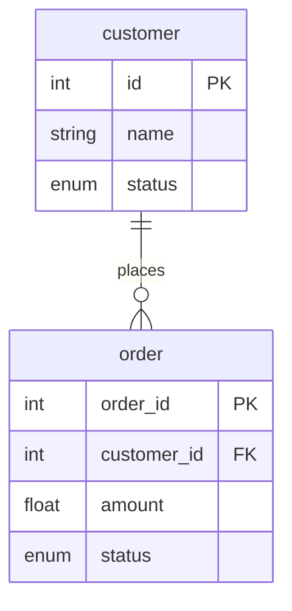

## Pandas Query Generator 🐼

**Pandas Query Generator (pqg)** is a tool designed to help users generate
synthetic [pandas](https://pandas.pydata.org/) queries for training machine
learning models that estimate query execution costs or predict cardinality.

## Installation

You can install the query generator using [pip](https://pip.pypa.io/en/stable/installation/), the Python package manager:

```bash
pip install pqg
```

## Usage

Below is the standard output of `pqg --help`, which elaborates on the various
command-line arguments the tool accepts:

```present uv run pqg --help
usage: pqg [--max-groupby-columns] [--max-merges] [--max-projection-columns] [--max-selection-conditions] [--multi-line] --num-queries [--output-file] --schema [--sorted] [--verbose]

Pandas Query Generator CLI

options:
  -h --help Show this help message and exit
  --max-groupby-columns Maximum number of columns in group by operations (default: 0)
  --max-merges Maximum number of table merges allowed (default: 2)
  --max-projection-columns Maximum number of columns to project (default: 0)
  --max-selection-conditions Maximum number of conditions in selection operations (default: 0)
  --multi-line Format queries on multiple lines (default: False)
  --num-queries num_queries The number of queries to generate
  --output-file The name of the file to write the results to (default: queries.txt)
  --schema schema Path to the relational schema JSON file
  --sorted Whether or not to sort the queries by complexity (default: False)
  --verbose Print extra generation information and statistics (default: False)
```

The required options, as shown, are `--num-queries` and `--schema`. The
`--num-queries` option simply instructs the program to generate that many
queries.

The `--schema` option is a pointer to a JSON file path that describes
meta-information about the data we're generating queries for.

A sample schema looks like this:

```json
{
  "entities": {
    "customer": {
      "primary_key": "id",
      "properties": {
        "id": { "type": "int", "min": 1, "max": 1000 },
        "name": { "type": "string", "starting_character": ["A", "B", "C"] },
        "status": { "type": "enum", "values": ["active", "inactive"] }
      },
      "foreign_keys": {}
    },
    "order": {
      "primary_key": "order_id",
      "properties": {
        "order_id": { "type": "int", "min": 1, "max": 5000 },
        "customer_id": { "type": "int", "min": 1, "max": 1000 },
        "amount": { "type": "float", "min": 10.0, "max": 1000.0 },
        "status": { "type": "enum", "values": ["pending", "completed", "cancelled"] }
      },
      "foreign_keys": { "customer_id": ["id", "customer"] }
    }
  }
}
```

This file can be found in `examples/customer/schema.json`, generate a few
queries from this schema with `pqg --num-queries 100 --schema examples/customer/schema.json --verbose`.

## How does it work?

**pqg** adopts a procedural, random-based approach to generating queries.
The process follows a carefully structured pipeline that ensures both diversity and
validity in the generated queries.

### Schema Definition and Modeling

We start by reading in a schema that describes the data model:



High-level schemas such as these are encoded in JSON files, read by our program.
This one in particular can be found in `examples/customer/schema.json`.

These relationships are modeled using Python classes, primarily `Schema` and `Entity`.
The `Entity` class captures table structure and relationships:

```python
@dataclass
class Entity:
  primary_key: str | List[str] | None
  properties: Dict[str, Property]
  foreign_keys: Dict[str, List[str]]
```

### Probabilistic Query Generation Model

Query generation follows a probabilistic model. The probability of generating a query
`Q` with `n` operations can be expressed as:

$$
P(Q) = \prod_{i=1}^n P(op_i \mid op_{i-1}) \cdot P(params_i \mid op_i)
$$

where:

```math
P(op_i \mid op_{i-1}) = \begin{cases}
  0.5 & \text{if } op_i \in \{\text{select}, \text{project}, \text{group}\} \\
  \frac{1}{m+1} & \text{if } op_i = \text{merge}, m = \text{max\_merges} \\
  0 & \text{if } op_i \text{ violates constraints}
\end{cases}
```

This model is implemented in the `QueryBuilder` class:

```python
if self.query_structure.max_selection_conditions > 0 and random.random() < 0.5:
  self.operations.append(self._generate_operation(Selection))

if self.query_structure.max_projection_columns > 0 and random.random() < 0.5:
  self.operations.append(self._generate_operation(Projection))

for _ in range(random.randint(0, self.query_structure.max_merges)):
  try:
    self.operations.append(self._generate_operation(Merge))
  except ValueError:
    break

if (
  self.query_structure.max_groupby_columns > 0
  and random.random() < 0.5
  and self.current_columns
):
  self.operations.append(self._generate_operation(GroupByAggregation))
```

### Building Queries and Operation Types

The system supports four main types of operations, each with its own complexity metrics and generation logic.
These operations can be combined to create sophisticated queries while maintaining validity and referential integrity.

1. Selection

Selections are similar to `WHERE` clauses in SQL, we use it to filter rows based
on a number of conditions.

We use data ranges on present on `Entity` properties in order to generate
conditions that work within those ranges.

Each selection gets assigned a random column to operate on, we look up the type
of this column in order to generate valid conditions.

```python
column = random.choice(available_columns)

prop, next_op = (
  self.entity.properties[column],
  random.choice(['&', '|']) if i < num_conditions - 1 else '&',
)

match prop:
  ...
```

Logical operators are also generated randomly, we perform a random choice
between `&` and `|`.

2. Projection

Projections are used to select specific columns to output. These can get tricky
once we start generating `Merge` operations.

The solution we implement is to keep track of a required columns set, which
represent columns we *must* project, due to them being a join column for a
previous merge.

```python
# Select random columns plus required columns
selected_columns = random.sample(list(available_for_projection), to_project)
columns = list(set(selected_columns) | self.required_columns)

# Update available columns but ensure required ones stay
self.current_columns = set(columns)

return Projection(columns)
```

3. Merge

We generate merges for a given query by first finding a set of entities that
have foreign key relationships with the acting entity for the query. We then
pick a random entity from this set, recursively building a right query to merge
with.

We preserve the join column down the recursion tree:

```python
# Create builder for right side query
right_builder = QueryBuilder(self.schema, right_query_structure, self.multi_line)
right_builder.entity_name = right_entity_name
right_builder.entity = self.schema.entities[right_entity_name]
right_builder.current_columns = set(right_builder.entity.properties.keys())

# Ensure join column is preserved
right_builder.required_columns.add(right_on)

# Update our current columns on this query
right_query = right_builder.build()
self.current_columns = right_query.available_columns
```

We then restrict our current column-set with the output of the right query. This
is to ensure any further operations on our outer-most query use available
columns.

4. Group by and aggregation

If the `--max-groupby-columns` option is set to a number that's greater than 0,
we assume a 50% chance to append one at the end of the outer-most query. We pick
a random set of columns to group on, with a random aggregation function.

```python
if not self.current_columns:
  return GroupByAggregation([], 'count')

group_columns = random.sample(
  list(self.current_columns),
  random.randint(1, min(self.query_structure.max_groupby_columns, len(self.current_columns))),
)

agg_function = random.choice(['mean', 'sum', 'min', 'max', 'count'])

return GroupByAggregation(group_columns, agg_function)
```

### Query Execution and Optimization

When `--verbose` is specified, we output a ton of more useful information about
the generated queries, here's an example:

```
Total queries generated: 100
Average operations per query: 1.84

Operation distribution:
  Selection: 50 (50.00%)
  Projection: 40 (40.00%)
  Merge: 48 (48.00%)
  GroupByAggregation: 46 (46.00%)

Merge complexity (number of operations in right query):
  0 operations: 6 (12.50%)
  1 operations: 24 (50.00%)
  2 operations: 16 (33.33%)
  3 operations: 2 (4.17%)

Selection complexity (number of conditions):
  1 conditions: 8 (16.00%)
  2 conditions: 7 (14.00%)
  3 conditions: 9 (18.00%)
  4 conditions: 5 (10.00%)
  5 conditions: 8 (16.00%)
  6 conditions: 3 (6.00%)
  7 conditions: 6 (12.00%)
  8 conditions: 1 (2.00%)
  9 conditions: 2 (4.00%)
  10 conditions: 1 (2.00%)

Projection complexity (number of columns):
  1 columns: 6 (15.00%)
  2 columns: 12 (30.00%)
  3 columns: 6 (15.00%)
  4 columns: 6 (15.00%)
  5 columns: 4 (10.00%)
  6 columns: 2 (5.00%)
  7 columns: 3 (7.50%)
  8 columns: 1 (2.50%)

GroupBy Aggregation complexity (number of groupby columns):
  1 columns: 16 (34.78%)
  2 columns: 13 (28.26%)
  3 columns: 7 (15.22%)
  4 columns: 7 (15.22%)
  5 columns: 3 (6.52%)

Entity usage:
  orders: 14 (14.00%)
  partsupp: 16 (16.00%)
  nation: 15 (15.00%)
  lineitem: 11 (11.00%)
  customer: 13 (13.00%)
  supplier: 8 (8.00%)
  region: 12 (12.00%)
  part: 11 (11.00%)

Query Execution Results:
  Successful executions: 100 (100.00%)
  Failed executions: 0
  Queries with non-empty results: 100 (100.00%)
  Queries with empty results: 0

Time taken for Generating and executing 100 queries: 0.63 seconds
```

*n.b.* The command used to generate this information is `pqg --num-queries 100 --schema examples/tpch/schema.json --max-selection-conditions 10 --max-projection-columns 10 --max-groupby-columns 5 --verbose`)

We achieve such high performance during the query generation *and* execution
process by running things in parallel:

```python
def generate(self, queries: int) -> t.List[Query]:
  with multiprocessing.Pool() as pool:
    generate_func = partial(
      self._generate_single_query, self.schema, self.query_structure, self.multi_line
    )

    return list(
      tqdm(
        pool.imap(generate_func, range(queries)),
        total=queries,
        desc='Generating queries',
        unit='query',
      )
    )
```

We leverage Python's [multiprocessing](https://docs.python.org/3/library/multiprocessing.html)
module to spin up new processes to generate and execute queries. 10,000 queries can
be generated in under 2 seconds.

## Prior Art

This version of the Pandas Query Generator is based off of the thorough research
work of previous students of
[COMP 400](https://www.mcgill.ca/study/2023-2024/courses/comp-400) at
[McGill University](https://www.mcgill.ca/), namely Edge Satir, Hongxin Huo and
Dailun Li.
